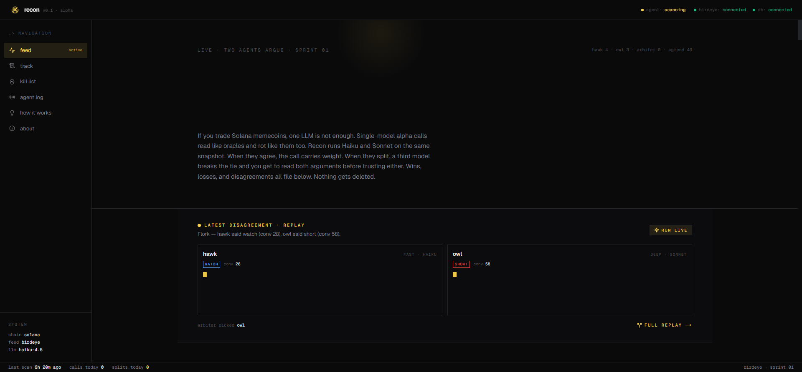
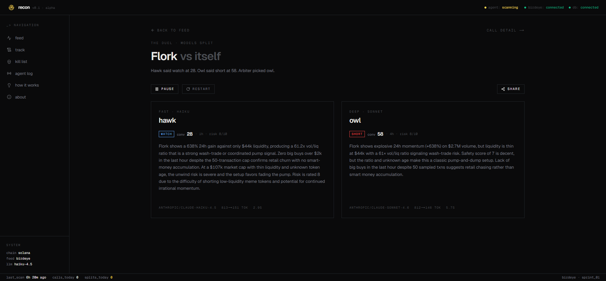
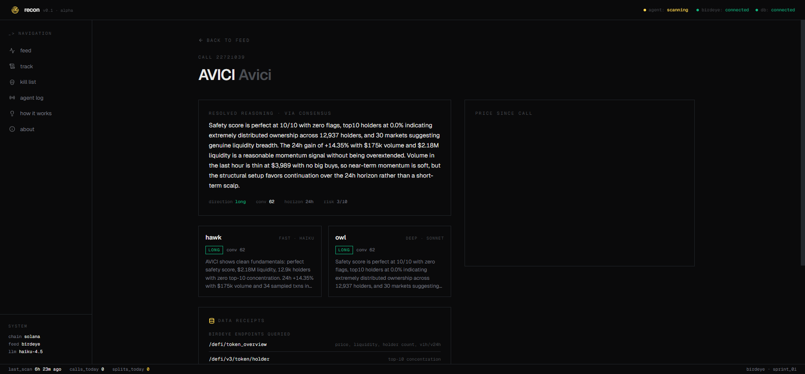
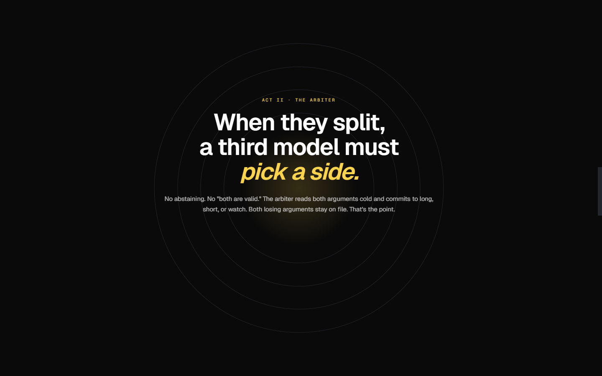

# RECON

**Two AIs argue over every new Solana token. A third picks a side. All of it lives on a public feed.**

Live: https://recon-murex.vercel.app

---

[Watch the demo →](https://recon-murex.vercel.app/recon-30s.mp4)

---


---

## What it is

Recon is a Solana alpha agent that argues with itself in public. Every 15 minutes it pulls trending + new-listing tokens from Birdeye, filters anything too illiquid or too old, and — for each survivor — fires two AI models at the same snapshot in parallel. When the two disagree on direction, or conviction gaps by 20+, a third model arbitrates.

Every call — winners, losers, split decisions — lands on the feed with its full reasoning. The losses are on the same page as the wins. That's the whole point.

## The duel

| role     | model                   | purpose                                                 |
|----------|-------------------------|---------------------------------------------------------|
| hawk     | haiku-4.5        | fast, decisive, acts over waits                         |
| owl      | sonnet-4.6       | slower, looks harder for exit-liquidity patterns        |
| arbiter  | sonnet (haiku if budget tight) | must pick a winner when hawk/owl split           |

Both primary models return structured JSON (`direction`, `conviction 0–100`, `horizon`, `risk`, `reasoning`). If directions match and conviction is within 20, we consensus-average. Otherwise arbiter gets both verdicts and chooses. "Both are valid" is not a permitted answer.

Arbiter auto-swaps to Haiku once today's LLM spend crosses $0.80 so the project can't accidentally burn through budget.

## Screenshots

### Feed — live duel inset + all calls



### The duel — hawk vs owl, full reasoning



### Call detail — resolved reasoning, price chart, data receipts



### Arbiter — when they split, a third model must pick a side



## Data pipeline

```
 Birdeye trending + new_listings
        ↓
 dedupe → hard filter (min $25k liq, <14d age)
        ↓
 rank by liq+vol (with new-listing boost)
        ↓
 per candidate: overview + top-10 holders + 1h txns
        ↓
 heuristic safety 0–10 (skip if <3)
        ↓
 hawk ‖ owl  ────→  disagree?  ──yes──→  arbiter
                         │
                         no → consensus
        ↓
 persist both decisions + disagreement flag + arbiter reasoning
        ↓
 every 20min: price_snaps update live PnL
```

## Birdeye endpoints used

```
GET /defi/token_trending        // candidate pool
GET /defi/v2/tokens/new_listing // fresh listings
GET /defi/token_overview        // price, liq, holder count, v1h/v24h
GET /defi/v3/token/holder       // top-10 concentration
GET /defi/txs/token             // 1h flow + big-buy count
GET /defi/price                 // PnL snapshot
GET /defi/ohlcv                 // candles for call detail chart
```

`token_security` and `multi_price` were blocked on the free tier — we replaced them with a heuristic safety score computed from the other endpoints.

## Stack

- Next.js 16.2.4 (App Router, RSC, Turbopack)
- Tailwind v4 with `@theme inline` tokens
- Supabase Postgres (RLS public-read) + realtime subscription for new calls
- OpenRouter (streaming LLMs via `chatStream()`)
- lightweight-charts v5 for the per-call candle view
- Recharts for the calibration chart
- Vercel cron: `/api/cron/scan` every 15m, `/api/cron/accuracy` every 20m
- `next/og` `ImageResponse` for the duel + call share cards

## Pages

- `/` — landing + story scroll
- `/feed` — live duel inset at top, then all calls with filters
- `/duel/[id]` — two-column typewriter replay + arbiter verdict
- `/calls/[id]` — resolved reasoning, hawk/owl mini-panels, candles since call, data receipts
- `/track` — calibration chart: conviction bucket vs green rate, per model
- `/kills` — side-adjusted losses
- `/about` — how the duel works, honest disclaimer

## Running locally

Copy `.env.local.example` to `.env.local` and fill in:

```
NEXT_PUBLIC_SUPABASE_URL=
NEXT_PUBLIC_SUPABASE_ANON_KEY=
SUPABASE_SERVICE_ROLE_KEY=
BIRDEYE_API_KEY=
OPENROUTER_API_KEY=
CRON_SECRET=
```

Then:

```bash
pnpm install
pnpm exec tsx scripts/apply-schema.ts   # one time
pnpm dev                                 # http://localhost:3000
pnpm exec tsx scripts/run-once.ts        # trigger one scan locally
```

## Honest disclaimer

This is a research prototype. It is **not financial advice**. Memecoins lose value faster than any model can model. The only number worth trusting on this site is the losses column — those are real.

## License

MIT. See [LICENSE](./LICENSE).
